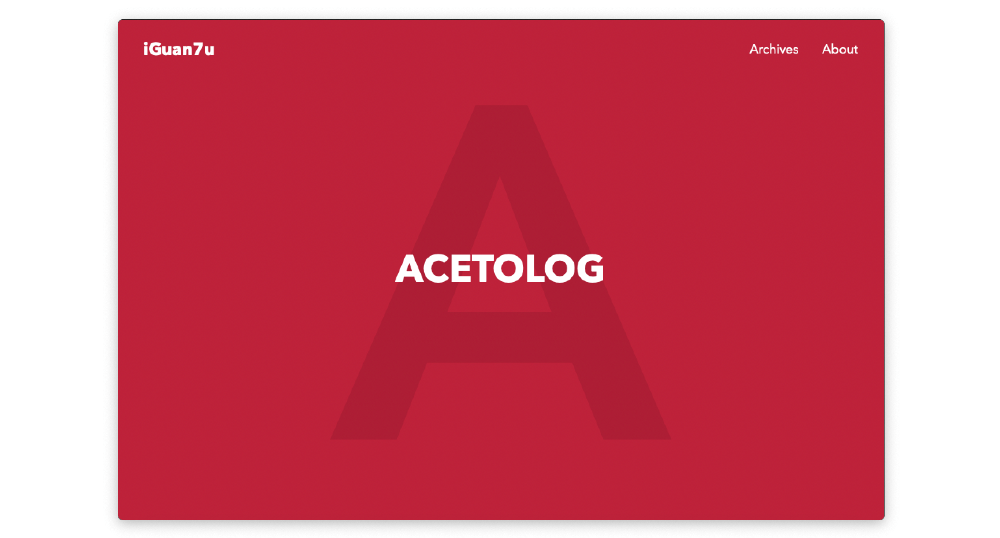

# Acetolog

[](https://github.com/hexojs/hexo)

A beautiful & simple hexo theme. Inspired by
[typology](https://demo.mekshq.com/typology/) and
[Bear](https://demo.mekshq.com/typology/). Aiming to be a simple but elegant
blog theme.



[LiveDemo](https://www.iguan7u.cn)

## Dependency

Acetolog **no longer** depends on any other libraries. Since you install hexo
successfully, you can switch theme to Acetolog, Smoothly. (Just as
hexo-theme-next did.)

## Install

1. Enter hexo theme folder

```
$: cd themes
```

2. Clone Acetolog from github

```
$: git clone https://github.com/iGuan7u/Acetolog
```

3. Modify hexo config change theme to `Acetolog`

```
theme: Acetolog
```

4. Generate new pages

```
$: hexo clean
$: hexo g
```

## Custom

### Comment:

- [Gitalk](https://github.com/gitalk/gitalk) Gitalk is based on Github issus. It
  requires less resources than disqus, saving your website loading time, a lot.
  By enaling `gitalk` config in acetolog theme `themes/Acetolog/_config.yml` to
  use it. **Recommanded**

- [Disqus](https://disqus.com) You can enable `disqus` config in theme config
  `themes/Acetolog/_config.yml`.

### Analytice:

Acetolog support:

- [UmamiAnalytice](https://umami.is/)
- [GoogleAnalytice](https://analytics.google.com)
- [BaiduAnalytice](https://tongji.baidu.com)
- ~~[TencentAnalytice](https://mta.qq.com)~~

You can modify the theme config `themes/Acetolog/_config.yml` to enable which
one you prefer.

### Code Block Highlight:

Acetolog support code block highlight by using hexo built-in function. Make sure
you enabled `highlight.enable` and`highlight.hljs` in your blog `_config.yml`.

```yml
highlight:
  enable: true
  hljs: true  # MAKE SURE ENABLE IT!
```

### Read Time:

Acetolog can display each page's word count nicely, you can enable it by
installing `hexo-wordcount`.

```
$: npm intall hexo-wordcount
```

That's it, no more configuration.

### Excerpt:

Acetolog can display page's excerpt in main page. If you don't setting excerpt
in each page, you can just setting it automatically by installing
`hexo-auto-excerpt`.

```
$: npm intall hexo-auto-excerpt
```

That's it, no more configuration.

### Dark Mode:

Now Acetolog support **Dark Mode**! You can change the color you prefer in
`themes/Acetolog/source/stylus/_var.styl`, of course, you can disable it by
commented the code below in `themes/Acetolog/source/css/style.styl`

```
@import "../stylus/darkTheme.styl";
```

### Main Theme Color:

You can modify the main colors to your preferred, they are `$theme_color` and
`$theme_color_light` in `themes/Acetolog/source/stylus/_var.styl`.

### Favicon:

[favicon.io](https://favicon.io) is the recommended favicon generation tool:
just generate, download, got `favicon_io.zip`, and unzip to your `source`
directory.

### IPC License:

You can enable it in theme config `themes/Acetolog/_config.yml`, chinese website
may need it.

## License

MIT
